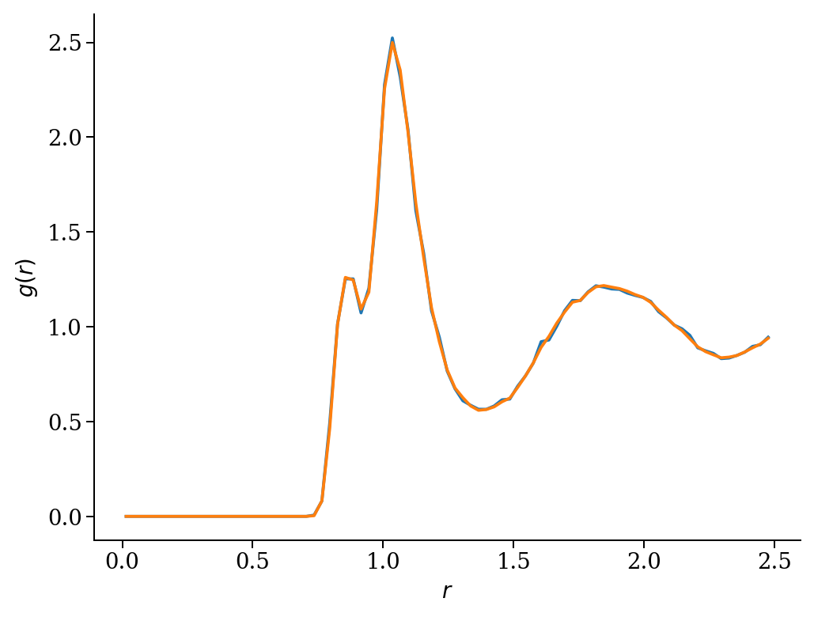

Postprocessing with atooms
--------------------------

.. toctree::

    index

In this tutorial, we are going to show how to perform standard analysis of molecular dynamics trajectories using the ``atooms`` package and its ``postprocessing`` component. You can install ``postprocessing`` from pypi: ``pip install atooms-pp``. 

Setup
~~~~~

We start by loading common libraries for plotting and path handling

.. code:: python

    import matplotlib.pyplot as pl
    import sys

We then import the ``postprocessing`` package and the trajectory class from ``atooms``. In this particular case, we will read a trajectory file in XYZ format, so we load the ``TrajectoryXYZ`` class

.. code:: python

    import atooms.postprocessing as pp
    from atooms.trajectory import TrajectoryXYZ 

We consider a sample trajectory, which can be download from the repository of the postprocessing package itself. Let's store the path to this file in a variable for later convenience

.. code:: python

    from atooms.core.utils import download
    download('https://framagit.org/atooms/postprocessing/raw/master/data/kalj-small.xyz', "/tmp")
    path = '/tmp/kalj-small.xyz'

Handling a trajectory
^^^^^^^^^^^^^^^^^^^^^

A trajectory is an object with many properties. To load a trajectory, we create an instance of the class as follows

.. code:: python

    th = TrajectoryXYZ(path)

The trajectory is a list-like object, in the sense that it can be iterated up and sliced. Each frame of the trajectory contains a ``System`` object, which is a full configration of the system at a given instant of time during the simulation. Here we print the first, the 10th and the last frame

.. code:: python

    th[0], th[10], th[-1]

::

    (<atooms.system.system.System object at 0x7f2b75818dc0>, <atooms.system.system.System object at 0x7f2b75825790>, <atooms.system.system.System object at 0x7f2b75775160>)

To know how many frames we have

.. code:: python

    len(th)

::

    101

To clarify: a slice is a list of frames, not a trajectory

.. code:: python

    th[10: 12]

::

    [<atooms.system.system.System object at 0x7f2b75813e50>, <atooms.system.system.System object at 0x7f2b75820850>]

.. note::

    It is actually possible to define a slice of a trajectory **as a trajectory** by using the ``Sliced`` class decorator, see below.

If the trajectory contains metadata, these can be retrieved directly:

.. code:: python

    from pprint import pprint
    print("Timestep during the trajectory:", th.timestep)
    print("Steps corresponding to the 3rd frame:", th.steps[2])
    print("Additional metadata:")
    pprint(th.metadata)

::

    Timestep during the trajectory: 0.001
    Steps corresponding to the 3rd frame: 2000
    Additional metadata:
    {'cell': [5.0, 5.0, 5.0],
     'columns': ['name', 'pos'],
     'dt': 0.001,
     'ndim': 3,
     'npart': 150,
     'step': 0}

Analysis of the trajectory
~~~~~~~~~~~~~~~~~~~~~~~~~~

Now that we have constructed a trajectory object, we can proceed to the analysis. We are going to consider two main aspects of the analysis:

- structural correlations

- dynamical correlations

Structural correlations
^^^^^^^^^^^^^^^^^^^^^^^

Radial distribution function
::::::::::::::::::::::::::::

The radial distribution function :math:`g(r)` describes how the local density varies as a function of the distance from a reference particle. In liquids, one normally averages over all particles, obtaining a descriptor of the probability to find a second particle a distance :math:`r` from a given particle, relative to that of the ideal gas.

For :math:`N` particles of the same type at density :math:`\rho` it is

.. math::

    g(r)=\frac{1}{N\rho}\left\langle\sum_i^{N}\sum_{i\neq j}\delta(r-|\mathbf{r}_i-\mathbf{r}_j|)\right\rangle

.

Notice that the average number of particles with a distance :math:`R`, i.e. the average **coordination number** :math:`n(R)`, can be computed from the radial distribution function via integration in spherical coordinates (for 3D systems)

.. math::

    n(R)=4\pi \rho\int_0^R g(r)r^2 dr

In ``postprocessing`` the radial distribution function is a ``Correlation`` object that acts on a trajectory. In order to compute it, we simply construct the object, specifying some parameters, and then run the calculation with the ``do()`` method

.. code:: python

    gr = pp.RadialDistributionFunction(th, norigins=5, dr=0.04)
    gr.do()

Once the calculation is performed, the radial distribution object ``gr`` contains (like all correlators in ``postprocessing``) two arrays:

- the ``grid`` array contains the independent variable (or variables), binned according to our input parameters (in this case, the smallest space interval that we resolve, ``dr``)

- the ``value`` array contains the actual value of the computation, in this case the values of :math:`g(r)`

We can directly plot the results with

.. code:: python

    pl.plot(gr.grid, gr.value)
    pl.xlabel("r")
    pl.ylabel("g(r)")

As we can see, the function displays two narrow peaks around :math:`r=1` and a broader peak further away. The presence of several peaks is due to the fact that the system actually contains two types of particles, noted :math:`A` and :math:`B`. 

We can compute separate distribution functions for the :math:`A` and :math:`B` particles and also the cross distribution funtion for the probability to find a particle :math:`B` at distance :math:`r` from particle :math:`A` using the ``Partial`` class:

.. code:: python

    gr = pp.Partial(pp.RadialDistributionFunction, species=['A', 'B'], trajectory=th, norigins=100)
    gr.do() 

In this case, the result contains a dictionary ``gr.partial``:

.. code:: python

    from pprint import pprint
    pprint(gr.partial)

::

    {('A', 'A'): <atooms.postprocessing.gr.RadialDistributionFunctionFast object at 0x7f7cbce85af0>,
     ('A', 'B'): <atooms.postprocessing.gr.RadialDistributionFunctionFast object at 0x7f7cbcea0f10>,
     ('B', 'A'): <atooms.postprocessing.gr.RadialDistributionFunctionFast object at 0x7f7cbcea08b0>,
     ('B', 'B'): <atooms.postprocessing.gr.RadialDistributionFunctionFast object at 0x7f7cbcea0460>}

We can treat the result as any normal dictionary: 

.. code:: python

    for key,g in gr.partial.items(): 
        pl.plot(g.grid, g.value, label=str("".join(key)))
    pl.legend()
    pl.xlabel("r")
    pl.ylabel(r"$g_{\alpha\beta}(r)$")

.. image:: gr_ab.png

Sometimes, it is useful to analyse only sections of a trajectory. To this purpose, one can slice the trajectory using ``atooms`` and analyse individual frames or subsets of frames. 

.. code:: python

    from atooms import trajectory
    t =  trajectory.Sliced(th, slice(-1, len(th)))  # analyse only the last frame
    gr = pp.RadialDistributionFunction(t, dr=0.04)
    gr.do()
    pl.plot(gr.grid, gr.value)
    pl.xlabel("r")
    pl.ylabel("g(r)")  # notice that the g(r) is more noisy

.. image:: gr_slice.png

Dynamical correlations
^^^^^^^^^^^^^^^^^^^^^^

Mean square displacement
::::::::::::::::::::::::

A very similar kind of anaysis can be performed on dynamical quantities, which quantify correlations in time.

The most elementary of such quantities is the mean squared displacement (MSD). This is defined as

.. math::

    \delta r^2(t)= \langle |\mathbf{r}(t-t_0) - \mathbf{r}(t_0)|^2\rangle

The average is normally perfomed over all the :math:`N` particles and over multiple values for the **origin** of time :math:`t_0`.

The analysis process is now familiar. First we construct the msd object and then perform the calculation with ``do()``.

.. code:: python

    msd = pp.MeanSquareDisplacement(th)
    msd.do()

.. code:: python

    pl.loglog(msd.grid, msd.value, 'o')
    pl.xlabel("t")
    pl.ylabel("MSD(t)");

.. image:: msd.png

Again, we can compute partial mean square displacements using the ``Partial`` class

.. code:: python

    msds = pp.Partial(pp.MeanSquareDisplacement, species=['A','B'], trajectory=th, norigins=100)
    msds.do()
    pl.loglog(msds.partial['A'].grid, msds.partial['A'].value, 'o')
    pl.loglog(msds.partial['B'].grid, msds.partial['B'].value, 'o')
    pl.xlabel("t")
    pl.ylabel("MSD(t)")

.. image:: msd_ab.png

Self intermediate scattering function
:::::::::::::::::::::::::::::::::::::

We compute the self part of the intermediate scattering function (ISF) at specific wave-vectors using a logarithmic time grid.

.. code:: python

    from math import pi
    import numpy
    tgrid = numpy.logspace(0, 3, base=10)  # we must include t=0
    isf = pp.Partial(pp.SelfIntermediateScattering, species=["A"], trajectory=th,
                     kgrid=[2*pi, 2.5*pi], nk=1, tgrid=tgrid)
    isf.do()

To get some info on the parameters passed to compute the ISF, have a look at the help for the base class with ``help(pp.fourierspace.FourierSpaceCorrelation)``

The ISF decays to zero at long times, as it should in an ergodic liquid.

.. code:: python

    pl.semilogx(isf.partial['A'].grid[1], isf.partial['A'].value[0], '-o') 
    pl.xlabel('t')
    pl.ylabel('ISF')

.. image:: isf.png

More correlation functions
^^^^^^^^^^^^^^^^^^^^^^^^^^

Here is the full list of correlation functions currently available in ``postprocessing``, along with the corresponding classes:

.. code:: python

    import inspect
    import atooms.postprocessing as pp
    for cls in inspect.getmembers(pp, inspect.isclass):    
        if issubclass(cls[1], pp.Correlation) \
           and cls[1] is not pp.Correlation \
           and not 'Fast' in cls[0] \
           and not 'Legacy' in cls[0] \
           and not 'Optimized' in cls[0] \
           and not 'Susceptibility' == cls[0]:
            print('- `{}`: {}'.format(cls[0], cls[1].long_name))

::

    - `BondAngleDistribution`: bond angle distribution
    - `Chi4SelfOverlap`: dynamic susceptibility of self overlap
    - `CollectiveOverlap`: collective overlap
    - `IntermediateScattering`: intermediate scattering function
    - `MeanSquareDisplacement`: mean square displacement
    - `NonGaussianParameter`: non-Gaussian parameter
    - `RadialDistributionFunction`: radial distribution function
    - `S4ktOverlap`: 4-point dynamic structure factor from self overlap
    - `SelfIntermediateScattering`: self intermediate scattering function
    - `SelfOverlap`: self overlap
    - `SpectralDensity`: spectral density
    - `StructureFactor`: structure factor
    - `VelocityAutocorrelation`: velocity autocorrelation

Some of them have multiple implementations (ex. ``Fast`` and ``Legacy``), which are picked at runtime depending on your platform. The fastest implementation will be automatically picked up, if possible.

Writing your own correlation function
~~~~~~~~~~~~~~~~~~~~~~~~~~~~~~~~~~~~~

We can extend the correlation class to compute additional correlation functions. The particle coordinates are loaded into the ``_pos`` instance variable as a list of numpy arrays. Each numpy array is a ``(ndim, npart)`` representation of the full particles' coordinates in a given frame of the trajectory. This is a gist of a new correlation class.

.. code:: python

    from collections import defaultdict
    import numpy

    def some_function(x, pos):
        return 0.0

    class NewCorrelation(pp.correlation.Correlation):
        def __init__(self, trajectory, grid):
            pp.correlation.Correlation.__init__(self, trajectory, grid)
            self.phasespace = ["pos"]

        def _compute(self):
            print("Computing new correlation")
            raw = defaultdict(list)
            for i in range(len(self._pos)):
                for x in self.grid: 
                    raw[x].append(some_function(x, self._pos[i]))        
            self.value = [numpy.mean(raw[x]) for x in raw]

.. code:: python

    nw = NewCorrelation(th, [0.0, 1.0])
    nw.compute()
    print(nw.value)

::

    Computing new correlation
    [0.0, 0.0]
